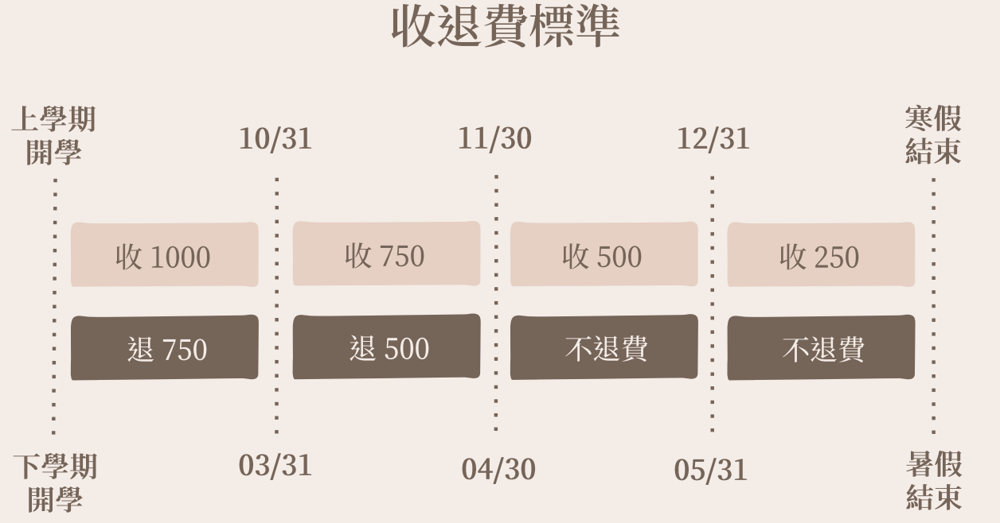

<!-- - 指導者: Analyst -->

## \# case 220722 網路狀況斷斷續續

- 流程 :
  1. `sh int b`
   
   
      ```txt
      正常speed應為1G，初步懷疑網路線有問題
      ```
  
  2. `sh log | include 1/1/x`
      很多的
      

      ```txt
      不斷Up和Down -> 懷疑爛線
      ```

    - 不斷顯示 `DHCP: snooping mapped to outgoing port 1/1/15 vlan 213 `

      ```txt
      懷疑手設IP和DNS有問題，但如果爛線，則應該先解決，應為如果實體層就有問題，其他問題也難以確認
      ```

  3. `sh int eth 1/1/x`
    晚上19:20
    
    下午13:45
    

      ```txt
      CRC和input errors的數值也很高且不斷增長，應該爛線
      ```
  
  4. 致電請使用者帶網線和筆電來cbb檢測
  5. 使用者沒接
  6. OSTicket 備註

     ```txt
      log不斷顯示Up和Down，CRC和input errors的數值也很高且不斷增長，應該是爛線，致電使用者未接
     ```
  
  7. OSTicket 寄信給使用者帶設備來cbb檢測

     ```txt
      正式回信給使用者 :
        點選案件回復，選一個罐頭回復，然後開頭同學你好，描述案件，我們發現是什麼問題造成，使用者要做什麼(有禮貌)
     ```

---

## LAB

- 使用者沒有申請網路
- 使用者超流段斷線
- 使用者中毒斷線

### 沒有申請網路

流程 :

1. 先詢問學號
2. 發現使用者在宿網系統中，顯示無申請資料，請使用者申請
3. 搜尋中正宿網，點選立即申請，登入，點申請
4. 告訴使用者繳費金額500，可以在周一到週五下午13:00 ~ 16:00 到資訊處219繳費 或者 電子繳費

    ```txt
    上學期：
      開學 至 10/31 繳費，1000；
      11/1 至 11/30 繳費，750；
      12/1 至 12/31 繳費，500；
      1/1  至 寒假結束前 繳費，250。

    下學期：
      開學 至 3/31 繳費，1000；
      4/1 至 4/30 繳費，750；
      5/1 至 5/31 繳費，500；
      6/1 至 暑假結束前 繳費，250。

    學期中繳費，則額外增加寒暑假網路
    ```

    資訊處位置

    ```txt
    在圖書資訊大樓:
      從中正大學正門，直直往前走直到走到噴泉，往左手邊看，會看到圖書資訊大樓
      往圖書館正門走時，往左邊看，會看到資訊處
      往櫃台走時，往右邊看，會看到219
    ```

### 超流斷線

流程:

1. 使用者表示手機、電腦無法上網
2. 詢問學號
3. 宿網系統顯示超流斷線
4. 告訴使用者超流斷線，每日0:00點後會恢復，不需要申請，並請使用者等15分鐘

### 中毒斷線

流程:

1. 使用者表示手機、電腦無法上網
2. 詢問學號
3. 宿網系統顯示中毒斷線
4. 告訴使用者中毒斷線
5. 請使用者登入中正宿網，在個人資料，點選斷線查詢，點選中毒斷線查詢，再點申請中毒復線
6. 告訴使用者在申請復線一天後將恢復

   ```txt
   復線時間
    第一次: 申請復線 開始計算1天後
    第二次: 申請復線 開始計算1天後
    之後: 申請復線 上一次天數加1，不斷累加直到14天
    ps: 記第一二次天數一樣
   ```

- 補充 :電話引導時，可以先詢問當前使用者的狀況、或今天做了什麼
  
  ```txt
  例如: 
   是否身邊有帶電腦 
   是否急著用網路，可以協助使用者使用 Wifi
   使用者中毒，可以詢問今天下載了什麼特別軟體
  ```

### 補充規範

電話 :
```txt
cbb : 73199 (大學部7開頭)
大學部宿管 : 73399
碩博宿管 : 82121
資訊處 : 14151
```

退費:
```TXT
上學期：
   開學 至 10/31 退費，750；
   11/1 至 11/30 退費，500；
   12/1 後 不提供退費。

下學期：
   開學 至 3/31 退費，750；
   4/1 至 4/30 退費，500；
   5/1 後，不提供退費。
```



智財權  :

```TXT
斷線 : 下載或上傳有版權問題的文件
恢復 : 第一次1個月後，第二次該學期都不能用，只能親自前往網管辦公室申請復線。
```

---

### 學到東西 和 改善

1. 複習所有規範，今天很多都要想一下，中毒還講錯天數
2. 再次複習如何判斷是否爛線
3. 需要將斷線復線、繳費退費、電話等記熟

---

### 心得

感謝Analyst在lab時提醒我，並幫我複習各個常用規範，今天很多規範都要想一下，並且有點不確定，透過這次lab應該對各個規範都比較熟，之後碰到這些問題，我應該不會在有猶豫了。
