- 指導人 : gunter

## \# case 220727 log出現很久

``` ssh
(1) Port Security secure MAC address c018.5002.cexx at interface ethernet 1/1/14 has moved to interface ethernet 1/1/13 in vlan 237
```

- 流程 :
    1. 用網管系統搜尋 MAC，找到使用者的資訊
   
    ```txt
    顯示 Switch 2xx.x[13]
    代表使用者應該插在port 13
    ```

    2. 發現有衝突

    ```txt
    根據上面log : 使用者應該插port 14但插去13 => 所以插錯孔
    但使用者在網管系統顯示port 13，所我有點迷茫
    ```
    >詢問指導人，確定網管系統顯示port 是代表使用者該插的port(申請時就決定好的)

    3. 查看使用者的 switch log
    `sh int b` : port 13, 14 都為down
    4. `sh log | include 1/1x`
13
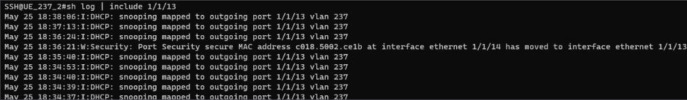
14
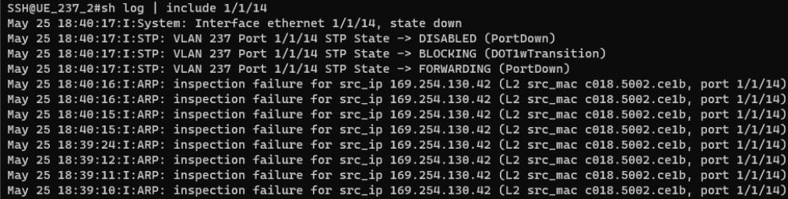

解Lab，沒繼續深究

```ssh
(2) Port Security secure MAC address 5882.a894.31xx is refreshed on interface ethernet 1/1/19 and not moved to interface ethernet 1/1/20 in vlan 237
```

- 流程 :
  1. 用網管系統搜尋 MAC，找到使用者的資訊
   
     ```txt
     顯示 Switch 2xx.x[19]
     代表使用者應該插在port 19
     ```
   2. 根據log, `綁在port 19 MAC被 port 20 用了` , 應該是插錯孔 (但也有可能網卡被人拿去用、網卡重複)

解Lab，沒繼續深究

---

## Lab

- 插錯孔
- Link error
- 綁錯 Mac
- IPV4 + DNS (手設)
- 共用
- proxy
  
流程 :

1. 詢問學號

    ```txt
    確定使用者有申請網路，並沒有中毒或超流斷線
    ```

2. 詢問是有線還WiFi => 有線
3. 查看 switch
4. `sh int b`
   發現 ERR-DIS 
   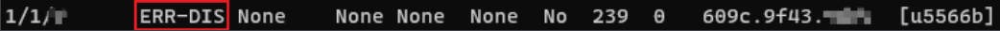
   ```
   懷疑BPDU或Link flap
   ```
   發現 旁邊Up
  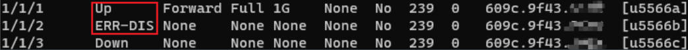
   ```
   有可能插錯孔 ，應該要先解決，因為這是實體層問題 
   失誤1 : 當下並沒有先處理
   ```
5.  排查 ERR-DIS
    1. `sh err summary` :沒顯示錯誤
    2. `sh link-error-disable` 
   
    
    3. `sh running-config interface eth 1/1/x`
    
    
    4. 比較其他port  (同樣用 `sh running-config interface eth 1/1/x`)
    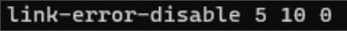

    5. 更正 
    ```ssh
    configure terminal
    interface ethernet 1/1/x
    link-error-disable 5 10 0
    ```
6. 發現port 變 down
   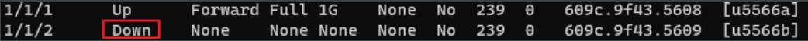

7. 排查 port down問題 
   1. `sh log | include 1/1/x`
    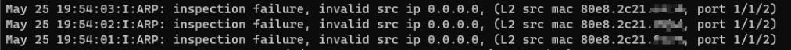
      ```txt
      出現這個，代表使用者可能有以下問題，等 port Up 要處理
      (1) proxy 沒關
      (2) 手設IP + DNS
      (3) Mac 綁錯
      失誤2 : 我不知道後面顯示是使用者的Mac，所以沒注意
      ```
    2. 沒看到 插錯孔 的log訊息
       ```txt
       ex : 
       (1) Port Security secure MAC address xxx.xxx.xxx.x at interface 
       ethernet 1/1/x has moved to interface 1/1/x in vlan 
       (2) Port Security secure MAC address xxx.xxx.xxx.x is refreshed on 
       interface ethernet 1/1/x and not moved to interface ethernet 1/1/x in vlan 
       
       失誤3 : 當時有點心急，應該要看完整個log，說不定有       
       ```
    3. 致電使用者依序檢查 網卡是否停用(解安裝) 、 有無插錯孔
       ```
       請使用者檢查是否插靠近自己的洞 -> 使用者插錯
       請使用者 window + R 輸入 ncpa.cpl -> 沒解安裝
                插拔網線 看圖標是否有變化  -> 有
                順便檢查是否有打勾 IPV4、IPV6
       ```
  8. port up 但還是不能用 
     1. `sh log | include 1/1/x`
     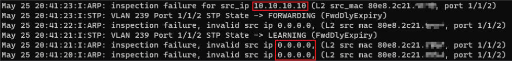
     2. 檢查 Mac
    網管系統
    
    switch log
    
    => MAC綁錯
     3. `sh running-config int eth 1/1/x`
       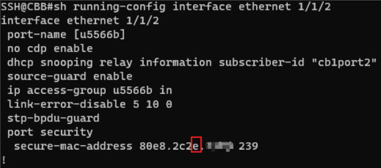
        ```
        port security 沒啟用
        mac 綁錯
        ```
9. 綁正確 Mac
    ```ssh
    configure terminal
    interface eth 1/1/x
    port security
    secure-mac-address 80e8.2c21.9xxx
    maxium 3
    violation restrict
    enable 
    end
    ```
    
    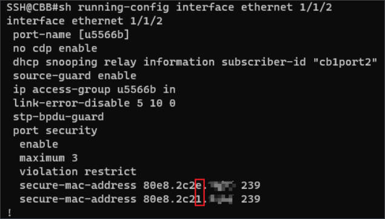
    ```txt
    失誤4 :  1.我沒有把錯的刪掉 (no secure-mac-address xxx.xxx.x) ，
             2.這裡是我請使用者修復IPV4+DNS、proxy問題後才處理，
             3.當時我是抱著試試的心態(因為我不知道inspection failure 後面顯示是正確Mac)
    ```
- 補充 : 
 修改Mac有三種方法 : 
   1. 致電請使用者至宿網個人頁面改
   2. 登入網管系統改
   3. switch 改 

10. 更正proxy 
     因為log 不斷出現這個
    
    1. 一直出現 ip 0.0.0.0
     ```
     懷疑手動proxy
     ```
    >[zoey學姊日誌](https://discourse.dorm.ccu.edu.tw/t/topic/410?u=ken)有清楚寫到這個問題，不然其實應該先檢查ipv4、ipv6不行才往proxy、共用想

    2. 致電請使用者更改proxy設定
    ```
    1. 右鍵點擊工作列的window符號，選設定
    2. 點選左列網路與網際網路
    3. 點選右列proxy
    4. 關閉手動proxy
    ```
11. IPV4+DNS 、共用
  log 也同時出現這個


    >如果出現inspection failure for src ip xxx.xxx.xxx.xx
（不是0.0.0.0也不是 169.254. 開頭）
代表是使用者自己手設IP，會無法連線上網，請他到變更介面卡選項
 引用自[Kirby](https://discourse.dorm.ccu.edu.tw/t/topic/609?u=ken)

    1.致電使用者到網路連線介面(window + R -> ncpa.cpl)
    2. 插拔網路線，請使用者看輕哪個圖標有改變
    3. 左鍵兩下有改變圖標的網路
    4. 請使用者Ipv4、Ipv6打勾
      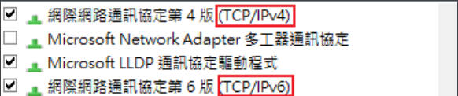
    5. 左鍵點擊兩下(Ipv4、Ipv6)，更改內容成自動取得(IP、DNS)
   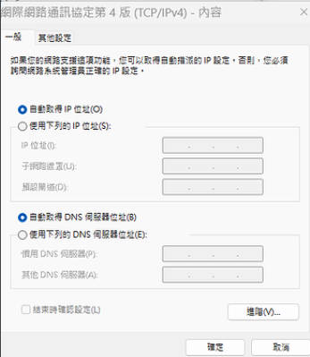
    6. 順便請使用者檢查共用，都不要勾起
    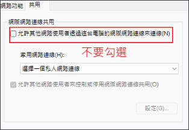

1.  致電使用者，使用者過了15分鐘打電話過來表示可用
    ```txt
    失誤5 : 當時回電給使用者，表示不行時有點心態炸裂，因為當時我其實還檢查 
    ACL、subscriber-id (在port為up 但無法使用網路時)
    ```

---
## 學到東西和改善
1. 應該要從實體層由下往上排查問題，可以減少很多不必要動作，並加快處理速度
2. 了解網路連線介面，插拔網線圖標不會消失，但會改變
3. ip 為什麼會0.0.0.0代表使用者根本沒有拿到我們宿網允許ip，所以應該從這角度去思考問題
4. 英文要加強，其實詢問過程中，使用者電腦介面是英文

---
## 心得
感謝gunter學長給我出的lab，讓我一次複習這麼多的觀念、問題，並在後面檢討問題時，詳細告訴我他怎麼判別，我感覺收穫很多。此外，也謝謝學長分享如何構建自己的解題流程，我也會盡快構築出自己的流程，今天真是又累又充足:)