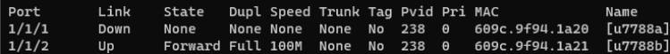

- 指導人 : zoey
---

## Case
## [案件 # 220734](https://osticket.dorm.ccu.edu.tw/scp/tickets.php?id=749)
1. 使用者懷疑有線網路是因為網路線問題
-> 之前查出可能有問題


1. 之前網管已經有請使用者代線來測

2.  我在這邊 `sh int e 1/1/x`


    ```
    感覺滿正常，無法判斷到底有沒有問題，得後續在追蹤
    ```

---
## Lab
- 英文Lab
- 沒有申請網路
- 床號被占用
- 卡號被占用
- 沒有Port security
- ACL 綁錯、設定錯誤

流程 :  

1. 詢問學號

2. 發現使用者沒有申請 
   1. 請使用者到ccu宿網申請 

   2. 使用者反映無法使用網路來搜尋 
   ```txt
   -> 請使用者跟同學或室友借網路，或來219 or cbb

   推薦作法 : 1. 請使用者連上 CCU_DormNet(_5G)
             2. 輸入 ccudorm 學年度
             3. 再瀏覽器輸入 140.123.238.6
             4. 就成功跳轉
   ```
   3. 點選立即申請
   
   4. 登入帳號 , 填寫資料

3. **床號被占用**
   
   1. 詢問房間號和床號 
   
   2. 跟宿管確認，透過學號姓名詢問 -> 確實是床號被人占用
   ```txt
   失誤一 : 1. 要先表明身分，和原因 ( 有同學填錯床號，因此要來確認)
           2. 要透過學號姓名詢問，不能要求提供xx房間學生的學號
   ```
   3. 透過床號搜尋是誰使用 (透過網管系統搜尋，例如 : 7788b) -> 跳出u7788b

   4. 更改占用者的床號 ，依然是透過致電宿管來確認，再到宿網系統更改

   ```
   1. 是致電者的室友 : 改完請致電者轉告
   2. 不是室友 : 電話通知一下
   
   重要 : 要osTicket通知
   ```
   > 可參考[osTicket換寢](https://osticket.dorm.ccu.edu.tw/scp/tickets.php?id=714)

4. **卡號被占用**
   
    1. 詢問使用者是否有借給別人、或使用別人的
    ```
    使用者表示是買別人的網卡
    ```
   2. 詢問卡號
   透過網管系統搜尋 
   ```
   失誤二 : 我當時電話沒直接問卡號，而是後面再打一次電話
               沒有確認到底有沒有插在socket上面、是否有輸錯...
   ```
 
   3. 將該卡號刪除(其他人綁過)
   4. 成功

5. 使用者詢問價錢、申請時間
   ```
   6/1以後皆為收250，直到暑假結束
   開學需再重新申請
   ```

6. **沒有Port security**
   1. 使用者致電說無法使用網路
    ```
    失誤三: 沒有詢問使用者的名字作第二次確認
           使用的OS 、 是否為有線網路 (這邊用英文對答時，就忘記問了)
    ```
   2. 網管系統無顯示超流 or 中毒

   3. 上switch查看設定

   4. `sh int b` -> port up 

   5. `sh ip dhcp snooping info`-> 有拿到 ip

   6. `sh log | include 1/1/2`

   ```txt
   有可能是 ACL 設定錯誤 or IPv4(6)、DNS、Proxy
   ```
   7. sh running-config int e 1/1/2 -> **沒有Port Security**

  
   8. 更正設定
   ```sh
   configure terminal
   int e 1/1/2
   port security
   secure-mac-address xxx.xxx.xxx.xxx
   maximum 3
   violation restrict
   enable
   ```
   
   ```
   失誤四 : 忘記 violation指令，只記得shutdown 、 restrict 
   ```

7. **ACL 綁錯、設定錯誤**
   1. `sh running config int e 1/1/2`  -> u7788b (acl)


   2. `sh access-list named-acl xxx` -> 是232


      

   3.  `ip access-list namecd-acl xxx`

   
   4. 套用
   ```sh
   configure terminal
   int e 1/1/2
   解除原本的套用
   no ip access-group xxx in
   套用新的
   ip access-group xxx in
   end
   ```
   ```
   失誤五 : 不熟悉指令
     總結 : 要更改acl東西 就得加 ip 前綴 
   ```
   5. 補充
   如果想快速更改某條規則

      ```sh
      con ter
      ip access-list named-acl xxx
      no sequence 數字
      sequence 數字 要給的規則

      ex : 
      no sequence 10
      sequence 10 permit ip host 140.123.238.231 any     
      ```

8. 致電使用者，使用者表示ok
---

## 補充

- 測是否爛線 

有三種方法 : 
1. `sh int b` -> 看**speed**


   ```txt
   正常應為1Gbps (Cat. 5e) or 100Mbps(Cat. 5)
   ```
2. `sh int e 1/1/x` -> 看input error 、 CRC
3. cable診斷
   ```
   phy cable-diag tdr 1/1/x
   show cable-diag tdr 1/1/x
   ```
   
   
   補充 : 
    tdr : Time Domain Reflectometry (時域反射術)
    ```txt
    懶人包 : 靠電信號反射
    
    當一個電訊號在某一傳輸路徑傳送時，若傳輸路徑中發生阻抗變化，則一部分訊號會
    被反射，而另一部分訊號會繼續沿傳輸路徑傳輸。
   
    利用該特性，藉由送出一個階梯電壓變化之訊號並測量反射訊號的電壓幅度，從而計算
    出阻抗的變化。此外，藉由量測訊號反射點到發射點的時間差，就可計算出傳輸路徑
    中阻抗變化點的位置。
    ```
4. `sh log | include 1/1/x` -> 不斷上下線也有可能 
---
## 改進

1. 得在複習一下指令
2. 英文還是得在練習
---
##  心得

感謝zoey學姊今天的指導，在Lab處理床號、卡號重覆時，不斷解釋我感到迷茫地方； 此外也非常感謝在lab後，讓我不斷詢問我感到疑惑的地方、並幫我加強一些觀念，今天真得非常充實:)