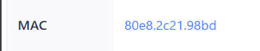

- 指導人: GodenFP

---

## Case
無

---

## Lab

- 插錯孔
- Mac綁錯
- subscriber-id
- DNS
- proxy (Firefox)

流程 : 

1. 詢問學號 ( 用顯示的名字做確認 )

2. 詢問有線 or WiFi -> 有線

3. 詢問使用 Window or Mac -> Mac
   ```txt
   失誤1 : 使用者有裝window的虛擬機
           因此請使用者點window的圖標如果不行，就應該再檢查是不是 Mac
           -> 這邊我卡了一下，經過提示才想到有可能用虛擬機           

           透過查看1. 右上角是否出現蘋果圖標(也有可能出現在其他角落)
                  2. 筆記本正面是否出現圖標圖標
   ```
4. **插錯孔**
    `sh int b`

    `sh log | include 1/1/6`

    ```txt
   失誤2 : 這個是當我檢查完是否爛線、網路介面的網卡連接後才檢查
           因為 1. 沒看到最下面的log
               1. 以為插錯孔通常是相鄰的Up，因此一開始就認為沒有插錯孔 
   ```
   請使用者插到正確的孔 -> **port up**


1.  發現使用者沒拿到ip
   `sh ip dhcp snooping info`

    
    ```txt
    懷疑可能是Mac 、 IPv4(6) DNS Proxy 、 Running-config 有錯誤
    ```
    `sh log | include 1/1/6`
    
    ```
    非常有可能是手設 IPv4 or DNS 
    ```

1. 由於還在電話上，因此直接請使用者檢查 IPv4(6) DNS Proxy
   ```txt
   失誤3 : 不熟悉 Mac ，在這邊卡了很久，一直得上網搜尋Mac圖片
   ```
   Mac步驟 : 
   1. 點右上角的蘋果圖案

   2. 選偏好設定 並選擇網路


   1. 點選已連線的網路 檢查使用者的 IPv4 是否為 使用DHCP 

   1. 點選進階
   2. 檢查DNS -> 確保所有的ip都是默認的，把其他都刪掉，直到左下角無法再減

   
   -> 該使用者填了很多其他的ip，因此請他刪掉
   
   1. 順便檢查 Proxy (代理伺服器) -> 正常右邊不要出現東西

**如果手設**


1. 還是沒拿到ip，因此掛斷電話去switch做檢查
   1. `sh running-config int e 1/1/` -> 發現Mac和登記不對 、 
id 多了個n (和其他port比較)



   1. 處理mac address
       (1) 致電使用者到網路介面最右邊(硬體)查看


      (2) 詢問使用者是他自己上ccuDormNet重新綁，還是我們幫他
      (3) 我們幫他
      ```txt
      con ter
      int e 1/1/6
      port security
      secure-mac-address xxx.xxx.xxx.xxx
      ```
   1. 處理 subscriber-id
    ```txt
    con ter
    int e 1/1/6
    dhcp snooping relay information subscriber-id xxx
    ```
   

1. ip直接沒有

   因此看ACL -> 沒錯誤


1. 沒頭緒因此請使用者用瀏覽器隨便搜尋，將結果告訴我 -> 出現連線逾時
    因此看了一下log `sh log | include 1/1/6`

   ```
   推測瀏覽器proxy問題
   ```
   ```txt
   失誤4 : 沒有問清楚瀏覽器是什麼
   失誤5 : 改完設定時，應該去看一下log (尤其沒頭緒時)
   ```
1.  處理 proxy (Firefox)
    1. 點右上角三條線
    2. 選 setting
    3. 搜尋 proxy
    4. 出現設定 ， 將proxy改為no proxy
2.  有網路了

---

## 補充

如果網卡真的重複如何手動更改 

1. 打開網路介面

2. 選擇連線的網路

3. 選內容 (Poperty)

4. 選設定


5. 改值


1. 值
找一個新的mac值念給使用者改，通常是AAAA?X?X?X?X，四個A後面隨意(符合十六進制就好)，先在網管系統上查過確認沒重複就可以，而輸入的時候不用加dot (.)，且字母會是全大寫
   > 引用自[zoey (8)](https://discourse.dorm.ccu.edu.tw/t/topic/371?u=ken)

---
## 改進
1. 必須再多看仔細一點，老是沒有將log看到底
2. 插錯孔也有可能是很遠的port up ，不能掉以輕心
3. 改完設定一定要叫使用者按確定 、 套用
---

##  心得

感謝GodenFP詳細幫我檢討今天做lab的缺失，幫我梳理了我的解題SOP，並教我如何場復，感覺我解lab又更上手一點，開心:)