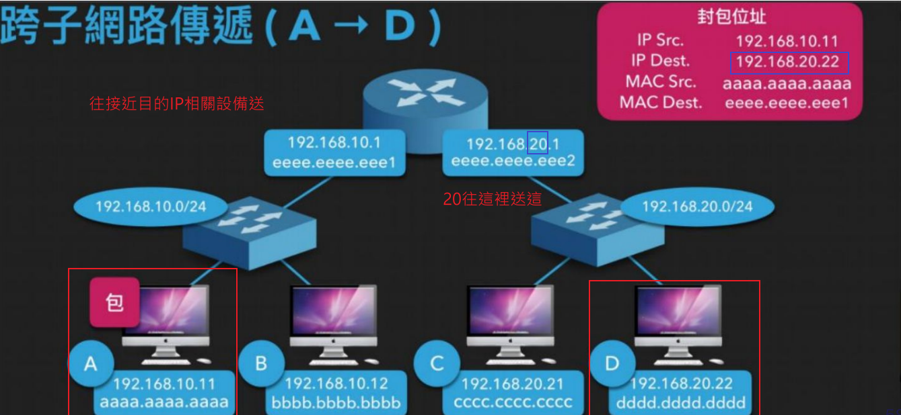

### 設備 

以我的學校舉例 :


### Switching

主要關聯 Link layer
設備 : Switch
建立 Mac - port 關係


ex : 當兩台電腦連接在同一個Switch，當A電腦送一個封包，目的地Mac為B電腦，當這個封包經過Switch就會查看Switching table 送到對應 port(這裡的port為物理層面跟機器相聯)

### Routing

主要關聯 Network layer
設備 : Router
建立 IP - port 關係



ex : 當兩台電腦距離很遠，當A電腦送一個封包，目的地IP為D電腦，當這個封包經過Switch、Router就會丟到與該IP接近的設備

### 追蹤指令

追蹤到某個節點相關經過節點

```bash
tracert (window)
traceroute (Linux)
```

ex :
`tracert 8.8.8.8`(Google)


### LAN

1. Broadcast
同一廣播域 只需 Switching 不需 Routing

2. Subnet Mask : 快速判斷是否為同一廣播域

    ```txt
    ex: 255.255.255.0
    同樣.同樣.同樣.不一樣
    ```

    ```txt
    A : 192.168.20.2
    B : 192.168.20.66 與A同LAN
    C : 192.168.1.2 與A不同LAN
    ```

- 補充Subnet Mask後面會接著`/數字`，代表有幾個1，其為8 Bit x 4

  ```txt
  255.255.255.0/24
  11111111.11111111.11111111.00000000
  ```

### VLAN

應用 : 不想不同網域，需要通過好幾台Router

- PVID (Port Vlan ID):
  從某 port 進來 untagged 封包屬於該 VLAN

- Untagged port :
  送出不帶Vlan tag的封包

>透過廣播，會傳給附近同廣播域的設備，一般設備接收不帶Vlan tag的封包，如果帶Tag就丟掉

- Tag port
  送出帶Vlan tag的封包

>帶Vlan tag的封包遇到Switch才會被接收，可與相同VLAN的Port實現傳輸，節省資源...

### DHCP

Dhcp server負責配發 :

1. ip
2. DNS server ip
3. Subnet Mask
4. Gateway


Discover (廣播)
Offer(不限)
Request（廣播）
Ack(不限)

### DNS

- 為了人類方便記億（ip被轉成網域）
- 透過DNS轉換 Domain 到對應 IP
- 可用指令 :
  
  ```sh
  nslookup (window)
  dig (linux)
  ```

### Arp

- IP - MAC
- 不同層需要轉換
- 設備接收到封包都會先檢查是否是給自己的MAC，不是自己的Mac或為廣播域(?)，就丟掉

- ARP 建立 :
廣播 ARP who know ip
可用WireShark


### STP(802.1d)

- 確定連結關係，存在多條路徑時讓port知道送去哪
- 建立spanning tree，不會重複經過
- BPDU就是為了建spanning tree

- STP需約30s建立
- log可能顯示 :
  
  ```txt
  DISABLE
  BLOCK路徑衝突
  FORWARD正常
  ```

- 如何建立 :
  
  ```TXT
  1. 決定Root Bridge,透過尋找最小的Bridge ID(透過計算優先度(默認32768，可手設) + MAC address)
  2. 透過網路頻寬，計算cost大小，通過尋找最小cost建立路徑
  3. 決定好就先把不是Root, Designated的路徑Block起來
  ```

### RSTP

- SFP升級，只需幾秒

### CDP/LLDP

- 用來發現相鄰設備
- 指令:

  ```sh
  show lldp neighbors detail
  ```

### SNMP

- 工作管理員（文字版）
查什麼東西就下什麼指令查狀態

- 數量很大，可以用某個系統定時向每台機器下SNMP

### SSH vs Telent

- 都是虛擬終端機（打開遠端機器的本地終端機）
- Telent沒有加密

- 指令 :

  ```sh
  ssh username@ip
  ```

- 由於window 可能會因為加密問題顯示錯誤，因此我們可以到 **/.ssh config** 改設定

### Proxy

- 代理
- 與VPN類似，但加密方式不同
- Server不知誰發的請求，連線過程額外加上一台裝置

ex : 在ACL擋掉其他人，只允許某設備

- 疑慮:
  安全？proxy 都看光光，只是看他處不處理
  網速可能下降

### Reverse proxy

- 不同系統，對外同個ip
- 不同台處理不同服務，對外同個ip
- 好幾台不同電腦處理同個服務，可以平衡負載
- ex : Ngix

<!-- ### DHCP Snooping 
當從dhcp得ip,由此設Arp
防止自行設定IP
DAI 
uplink trust
IpSG
不是dhcp流量不理 -->
