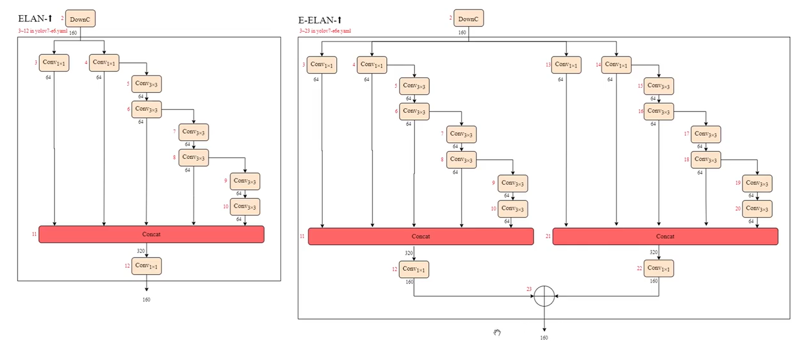

參考網站:
1. [WongKinYiu/yolov7](https://github.com/WongKinYiu/yolov7)
2. [YOLOv7论文，网络结构，官方源码，超详细解析](https://www.bilibili.com/video/BV1Ld4y1W7VP/?p=2&spm_id_from=333.1007.top_right_bar_window_history.content.click&vd_source=eedb40643793ea7852c5f0638ff5932c)


# YOLO V7   

## 結構
### ELAN
<center>

</center>

實際實現

```python
# [from, number, module, args]
[-1, 1, Conv, [128, 3, 2]], #160x160x128 
   [-1, 1, Conv, [64, 1, 1]], #4
   [-2, 1, Conv, [64, 1, 1]], #5
   [-1, 1, Conv, [64, 3, 1]], #6
   [-1, 1, Conv, [64, 3, 1]], #7
   [-1, 1, Conv, [64, 3, 1]], #8
   [-1, 1, Conv, [64, 3, 1]], #9
   [[-1, -3, -5, -6], 1, Concat, [1]], #10
   [-1, 1, Conv, [256, 1, 1]],  # 11
```


### E-ELAN

等價於並行兩個ELAN結構
實現
```PYTHON
   [-1, 1, DownC, [160]],  # 2-P2/4  
   [-1, 1, Conv, [64, 1, 1]],
   [-2, 1, Conv, [64, 1, 1]],
   [-1, 1, Conv, [64, 3, 1]],
   [-1, 1, Conv, [64, 3, 1]],
   [-1, 1, Conv, [64, 3, 1]],
   [-1, 1, Conv, [64, 3, 1]],
   [-1, 1, Conv, [64, 3, 1]],
   [-1, 1, Conv, [64, 3, 1]],
   [[-1, -3, -5, -7, -8], 1, Concat, [1]],
   [-1, 1, Conv, [160, 1, 1]],  # 12
   [-11, 1, Conv, [64, 1, 1]],
   [-12, 1, Conv, [64, 1, 1]],
   [-1, 1, Conv, [64, 3, 1]],
   [-1, 1, Conv, [64, 3, 1]],
   [-1, 1, Conv, [64, 3, 1]],
   [-1, 1, Conv, [64, 3, 1]],
   [-1, 1, Conv, [64, 3, 1]],
   [-1, 1, Conv, [64, 3, 1]],
   [[-1, -3, -5, -7, -8], 1, Concat, [1]],
   [-1, 1, Conv, [160, 1, 1]],  # 22
   [[-1, -11], 1, Shortcut, [1]],  # 23
```


### 模型縮放
因為ELAN涉及拼接，因此縮放需特別設計
對應關係 : 
1. yolov7 $\rightarrow$ yolov7x
  1. 額外多一條由兩個卷積構成支路 : 擴大模型深度
  2. 特徵輸入數量，concat輸出數量，過度卷積通道數 變成 1.25倍

## Trainable bag-of-freebies